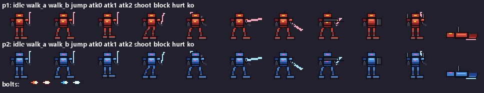

# MECH DUEL 钢铁对决

复古像素风横版机甲格斗游戏。纯 Python + pygame 实现，**零外部资源**——角色、场景、音效、BGM 全部由代码程序化生成。



三局两胜 · 每局 60 秒 · 本地双人 / 挑战 AI / 训练模式 / AI 演示，支持键位重映射与手柄。

## 运行

依赖：Python 3.10+，`pip install pygame`

```
python main.py            # 正常启动（菜单 → 选人 → 对战）
python main.py --demo     # AI 演示模式（AI 对 AI，自动循环开打）
python main.py --selftest # 无窗口逻辑自测（20 项回归，含 AI vs AI 平衡回归）
```

打包 Windows exe：双击 `build.bat`，或按需组合参数：

```
python build_exe.py --onedir --smoke --zip
# --onedir 单目录启动更快 | --smoke 打包后跑自测 | --zip 额外产 zip | --clean 清理重建
```

## 操作

### 菜单

| 键 | 功能 |
|---|---|
| `1` / `2` / `3` | 双人对抗 / 挑战 AI / 训练模式（后两者先选人，AI 侧随机机体） |
| `4` / `5` / `6` | AI 演示 / 按键设置 / 街机模式（连胜 3 局通关） |
| `E` | 轮换场地：废墟月夜 / 熔炉黎明 |
| `TAB` | 轮换 AI 难度：简单 → 普通 → 困难 |
| `V`（结算页） | 整局录像回放 |
| `M` | 全局静音（BGM + 音效，战斗曲 A/B 按局轮换） |
| `ESC` | 返回上级 / 退出 |

### 对战（可在 [5] 按键设置中重映射，`keymap.json` 持久化）

| 动作 | P1 | P2 |
|---|---|---|
| 移动 | `A` / `D` | `←` / `→` |
| 跳跃（空中可斩击/射击） | `W` | `↑` |
| 防御 | `S` | `↓` |
| 斩击 | `J` | `小键盘1` |
| 光束 | `K` | `小键盘2` |
| 投技 | `L` | `小键盘3` |
| 超必杀（槽满） | `I` | `小键盘4` |
| 冲刺 / 后撤步 | 双击 `A` / `D` | 双击方向 |

手柄无需配置：1 号手柄 → P1，2 号 → P2；十字键/左摇杆移动，按钮 0/1/2/6 = 斩/束/投/重击，3/4/5 = 超/防/跳。

对战中 `R` 重开本局，`ESC` 回菜单。训练模式：`F1` 显示判定框、`F2` 假人自动格挡、`R` 重启假人，底部实时帧数据。

### 四台机甲

| 机体 | HP | 定位 | 专属能力 | 超必杀 |
|---|---|---|---|---|
| GARNET 红莲 | 104 | 重装，近战 10 | 装甲冲撞（霸体） | Lv1「熔核冲击」冲撞 · Lv2 地裂冲击（霸体+冲击波）· Lv3 熔核天崩（抓取） |
| AZURE 苍鳍 | 105 | 轻快，近战 10 | 机动力特化 · 相位刺 | Lv1「苍蓝射线」贯穿 · Lv2 疾影射线 · Lv3 苍穹风暴（8 连贯穿） |
| VERDANT 翠岚 | 118 | 机动，近战 12 | 空中二段跳 · 藤蔓勾拉 | Lv1「翠暴轰炸」 · Lv2 连天翠暴 · Lv3 世界树降临（天降轰炸） |
| VIOLET 紫电 | 102 | 电击，近战 10 | 全场最快移速 · 雷殛突进 | Lv1「紫电狂涛」追踪弹 · Lv2 瞬影乱舞 · Lv3 九天雷罚（瞬移背袭） |

### 出招表

**通用招式**（四机共用；连段规则：轻斩命中/被防可取消进特殊技与超必杀，轻→重为目标连段）

| 指令 | 技 | 说明 |
|---|---|---|
| `J` | 轻斩 | 可连打 2 链；伤害=各机近战值 |
| 空中 `J` | 空中下劈 | 0.75 × 近战伤害 |
| `L` | 投技 | 无视格挡，只抓地面目标；抓取前 6 帧内按投可拆投 |
| `J`+`U` 快速连按（≤4 帧） | Drive 冲击 | 28 伤击飞，吸收一段伤害；命中贴墙目标 → 墙崩（眩晕 40 帧） |
| 防御瞬间 | 完美格挡 | 按防 5 帧内被击：无伤弹开，攻方踉跄，回 Drive 并解锁免费绿冲 |
| 防御中 `→+U` | 逆转反技 | 14 伤击倒，耗 2 格 Drive |
| `→`+`J`+`K` 快速连按（≤4 帧） | OD 强化技 | 各机特殊技强化版，耗 1 格 Drive |
| 取消窗内双击前 | 绿冲 | 高速突进，耗 1 格 Drive；完美格挡后 30 帧内免费 |
| 落地 12 帧内 `跳`/`防` | 受身 | 击倒呈躺地姿态，受身快速起身 + 20 帧无敌 |

**GARNET 红莲**（重装 · HP 104 · 近战 10 · 投技 18）

| 指令 | 技 | 伤害 | 属性 |
|---|---|---|---|
| `U` | 重击 | 18 | 击倒 |
| `→+U` | 烈突 | 22 | 对防御槽伤害 ×1.5（破防特长） |
| `←+U` | 横扫 | 18 | 击倒 |
| 空中 `U` | 踏压 | 15 | 击倒 |
| 冲刺中 `J` | 装甲冲撞 | 13 | **霸体**（吸收一段伤害）· 击倒 |
| `→+K` | 熔核喷发 | 10 | 近距火焰弹（射程 90） |
| `I` / `→+I` / `←+I` | 熔核冲击 / 地裂冲击 / 熔核天崩 | 30 / 34+冲击波 / 50 | 冲撞不可防+击飞；Lv2/3 冲撞全程霸体；Lv3 为抓取 |

**AZURE 苍鳍**（轻快 · HP 105 · 近战 10 · 投技 15）

| 指令 | 技 | 伤害 | 属性 |
|---|---|---|---|
| `U` | 重击 | 18 | 击倒 |
| `→+U` | 突蹴 | 21 | 突进 |
| `←+U` | 对空斩 | 16 | 击倒（空中对手加成） |
| 空中 `U` | 俯冲刃 | 14 | 斜下急坠 |
| 冲刺中 `J` | 相位刺 | 14 | 突进（全场最快冲刺技） |
| `→+K` | 裂地光刃 | 7 | 贴地快弹（射程 200，跳过即 miss） |
| `I` / `→+I` / `←+I` | 苍蓝射线 / 疾影射线 / 苍穹风暴 | 2×12 / 3×8 滑步 / 8×6 | 贯穿激光：全屏射程，命中后继续飞行（狙击型） |

**VERDANT 翠岚**（机动 · HP 118 · 近战 12 · 投技 16）

| 指令 | 技 | 伤害 | 属性 |
|---|---|---|---|
| `U` | 重击 | 19 | 击倒 |
| `→+U` | 鞭腿 | 22 | 击倒（浮空连段入口） |
| `←+U` | 扫击 | 17 | 击倒 |
| 空中 `U` | 种子散布 | 4×2 | 撒落延时雷 |
| 冲刺中 `J` | 藤蔓勾拉 | 14 | 拉近对手 + 击倒 |
| `→+K` | 弧线榴弹 | 10 | 越顶抛物线轰炸 |
| `←+K` | 种子地雷 | 8 | 脚前布雷，静置 60 帧（同屏最多 2 颗） |
| 空中二段跳 | （专属机动） | —— | 全场唯一 |
| `I` / `→+I` / `←+I` | 翠暴轰炸 / 连天翠暴 / 世界树降临 | 2×12 / 4×10 / 6×8 | Lv1/2 弧线榴弹；Lv3 天降轰炸：落点环绕对手从天而降（覆盖型） |

**VIOLET 紫电**（电击 · HP 102 · 近战 10 · 投技 16）

| 指令 | 技 | 伤害 | 属性 |
|---|---|---|---|
| `U` | 雷击 | 18 | 击倒 |
| `→+U` | 雷突 | 20 | 突进 |
| `←+U` | 电扫 | 15 | 击倒 |
| 空中 `U` | 雷坠 | 13 | 急坠 |
| 冲刺中 `J` | 雷殛突进 | 13 | 出招最快的突进技（9 帧前摇）· 击倒 |
| `→+K` | 电光球 | 8 | 中速电弹（射程 160） |
| `I` / `→+I` / `←+I` | 紫电狂涛 / 瞬影乱舞 / 九天雷罚 | 5×4 追踪 / 3×11 瞬步 / 背袭+8×5 | 追踪电弹弹道会转向；Lv2 三段瞬步斩；Lv3 瞬移至对手背后再放追踪弹（追猎型） |

> 帧数据与完整旗标见 `settings.py::MOVE_DEFS`（数据驱动，出招表以此为准）。
> 重击三变体各有专属动作帧（直刺/升斩/低扫/肩撞/投掷，不再千篇一律挥剑），
> 重击/特殊技弧光带机体专属色（红橙/青蓝/酸绿/电紫）。

### 核心系统

- **攻防三角**：打克投、投克挡、挡克打。格挡 80% 减伤但仍削 1 血（chip）；投技无视格挡但只抓地面目标（跳跃可躲、落空 26 帧硬直可被惩罚）。
- **破防槽**：连续格挡会耗尽防御槽，槽空触发 GUARD BREAK——55 帧大硬直，期间无法防御。
- **超必杀槽**：3 层 ×100（命中 +18 / 受击 +12 / 格挡 +6），按方向选 Lv1-3，Lv3 带专属演出。四机机制互异：红莲冲撞/抓取 · 苍鳍贯穿激光 · 翠岚榴弹/天降覆盖 · 紫电追踪/瞬步。
- **连段与受身**：斩击命中后的后摇可取消接光束/投技/跳跃；空中目标被命中会浮空可追打（juggle），落地 12 帧内按住跳/防受身起身并获 20 帧无敌。被投/击倒躺地期间攻击穿透（不可被压起身连打），起身恢复。
- **空中压制**：空中下劈（0.75 倍伤害）、空中射击（弹道斜向下）。
- **打击感**：hitstop 顿帧、屏幕震动、受击白闪、浮动伤害、幽灵血条、KO 慢镜头 + 高光回放（KO 自动慢放最近 100 帧）。
- **运动签名**（纯表现层）：前冲/绿冲/突进技/超必杀突进时会拖出机体专属残影——红莲「熔渣余像」厚重稀疏带扬尘 · 苍鳍「相位残像」细密快散 · 翠岚「花瓣拖尾」飘落绿瓣 · 紫电「闪电残像」最密且带电弧；超必杀瞬移落点留「现形残影」。残影不参与判定、不进回放。

## 架构

```
main.py        入口：场景机（菜单/选人/对战/街机/键位/结算）、窗口主循环
fight.py       战斗核心 Fight：回合流程、输入、判定结算、KO 高光回放、街机链
selftest.py    无头自测：38+ 项回归用例（python main.py --selftest）
scene_flow.py  场景流：选人 / 按键设置 / 手柄输入合并 / 演示轮换 / 战绩存档
settings.py    全部数值的单一来源：键位表、机甲规格、战斗参数、AI 难度表、调色板
assets.py      内置像素素材系统：字符画 → 调色板 → 运行时生成 Surface；直接运行
               本文件可输出 preview.png 素材总览
mech.py        Mech 状态机（idle/walk/jump/melee/shoot/block/throw/dash/super/
               guard_break…15 态）+ 判定盒 + 动画相位
effects.py     光束弹（直线/强化/弧线榴弹三种弹道）、粒子、伤害数字、震屏、白闪
ai.py          AI 控制器：意图计划 + 反应性防御（挡近战/躲弹/抓投/拆投），
               输出与真人按键同构的虚拟 input，三档难度全参数化
ui.py          HUD（血条/破防槽/超必杀槽/计时/回合星）、菜单、选人、键位设置、结算
sfx.py         程序合成 8-bit 音效（方波/噪声）+ chiptune BGM（菜单曲/战斗曲循环）
```

两个贯穿性设计，改代码前值得知道：

1. **AI 输出与真人按键同构**——AI 只往 `mech.input` 字典写虚拟按键，战斗核心不感知输入来源。训练模式、录像回放、难度分级因此都不用动战斗逻辑；`--selftest` 的平衡回归也正是靠它无头跑 AI 对局。
2. **数值全部走 settings.py**——平衡调整有单一入口；禁止把数值散落到逻辑代码里。

## 素材扩展

### 加一台新机甲（约 10 行，自动获得全部动作与招式）

1. `settings.py::MECH_PALETTES` 加一套调色板（如 `"p4"`）；
2. `settings.py::MECH_SPECS` 加规格（HP/移速/近战/投技/超必杀伤害/`air_jumps` 等专属机动）；
3. `settings.py::MECH_ORDER` 加入新 key，`BOLT_PALETTES` 可选加新光束配色。

帧图由 `assets.build_mech_frames()` 按调色板自动生成，选人界面/HUD/回放自动识别。

4. **（强烈建议）做剪影差异化**，否则新机甲只是「同骨架换皮」：
   - `assets.py::PAL_PARTS[新pal]` 覆盖部件，最低 `upper_idle` + `legs_idle`；
     完整做法是上身六件套（idle/atk0/atk1/shoot/block/hurt）——攻击/受击姿态
     也差异化，`_variant_upper(idle上身, {行号: 该行画})` 以 idle 为底只覆盖肩臂行；
   - `assets.py::PAL_SABER[新pal]` 定制各招式光刃形状，style 取
     `axe` 重斧 / `lance` 刺剑 / `whip` 软鞭 / `saw` 电锯 / `blade` 直线；
     待机/移动帧的刃柄要**紧贴肩甲外缘**（起点 x = 肩甲右缘 + 1、y 落在肩甲所在行），
     攻击帧的刃起点落在臂端相邻格；`shoot` 帧武器是炮，记 `None`；
     放内侧会被肩甲遮掉，放太远又会悬空。
   未覆盖的部件自动继承通用骨架。
5. **运动签名**：`settings.py::AFTERIMAGE_STYLES[新pal]` 加一套参数
   （`interval` 快照间隔 / `life` 存活帧 / `tint` 染色，可选 `dust_burst`/
   `petals`/`bolt`），否则新机体高速位移时没有专属残影。

> ⚠ **画字符画的两条硬约束**（selftest [37] 会拦，但先知道能少走弯路）：
> 1. **不能出现悬空碎块** —— 部件之间差一格，2x 放大后就是「肩甲脱离躯干 /
>    武器浮在半空 / 电弧离脚两格」。[37] 对 4 台 × 15 帧 = 60 帧做 4-连通检查。
> 2. **斜线不算连通** —— 对角相接的两点在 4-连通下是断开的，放大后会看到缝。
>    天线、尖刺之类要画成**垂直**的，不要拉斜线。

### 调色板字符含义

`O` 描边 · `A` 主装甲 · `B` 暗部 · `L` 亮部 · `J` 关节 · `C` 传感器 · `S` 光剑刃 · `G` 武器深色 · `E` 能量 · `W` 白高光

### 加/改一个动画帧

`assets.py::FRAMES` 每项 = `(帧名, 上身部件名, 腿部部件名, 光刃参数)`。部件名查 `BASE_PARTS`（40×30 字符画，`row()` 或 `_at()` 帮助拼行，宽度必须正好 40）；光刃参数 `(起点x, 起点y, 角度°, 长度[, style])`，style 取 `blade`/`axe`/`lance`/`whip`/`saw`——只写入空像素格，所以剑在身后时会被身体正确遮挡。加完新帧后在 `mech.py::ANIMS` 或对应状态的相位逻辑里接线，并在 `settings.py` 配数值。

### 场景与光束弹

背景在 `assets.build_background()` 程序绘制（夜空色带/星空/月亮/双层废墟/金属地面）；光束弹是 10×5 字符画两帧闪烁（`BOLT_MAP`），强化弹放大 2 倍。

## 自测与平衡

```
python main.py --selftest            # 20 项无头回归（移动/判定/取消/受身/超必杀/破防…）
MECHDUEL_BALANCE_N=400 python main.py --selftest
                                     # 平衡回归局数可调（默认 100）：
                                     # AI vs AI 每对机体左右互换，P1 胜率出 45%-55% 带宽即报警
```

平衡回归曾揪出同帧对拼的先手方结算偏置（P1 胜率 59%）并推动修复，是调 `settings.py` 数值后的必跑项。无头冒烟：`MECHDUEL_SMOKE=N`（N 帧后自动退出）配合 `MECHDUEL_SMOKE_SCENE=select|keyconfig|training` 可无显示环境过一遍各场景。

## 设计文档

评审结论、问题分级（P0-P3）与四阶段落地过程见 [design/DESIGN_ROADMAP.md](design/DESIGN_ROADMAP.md)。
